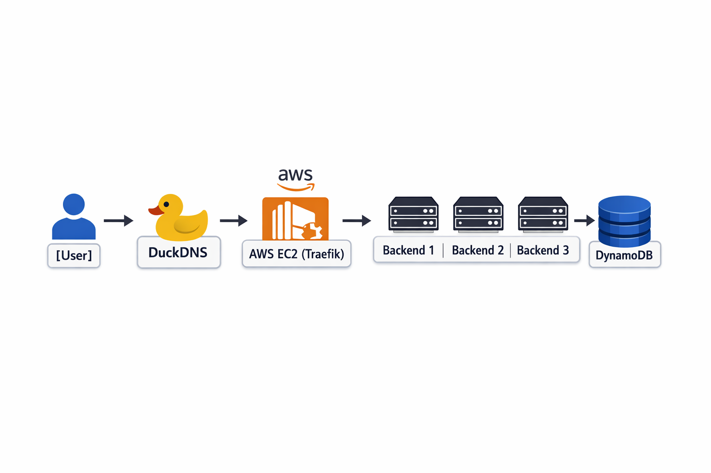
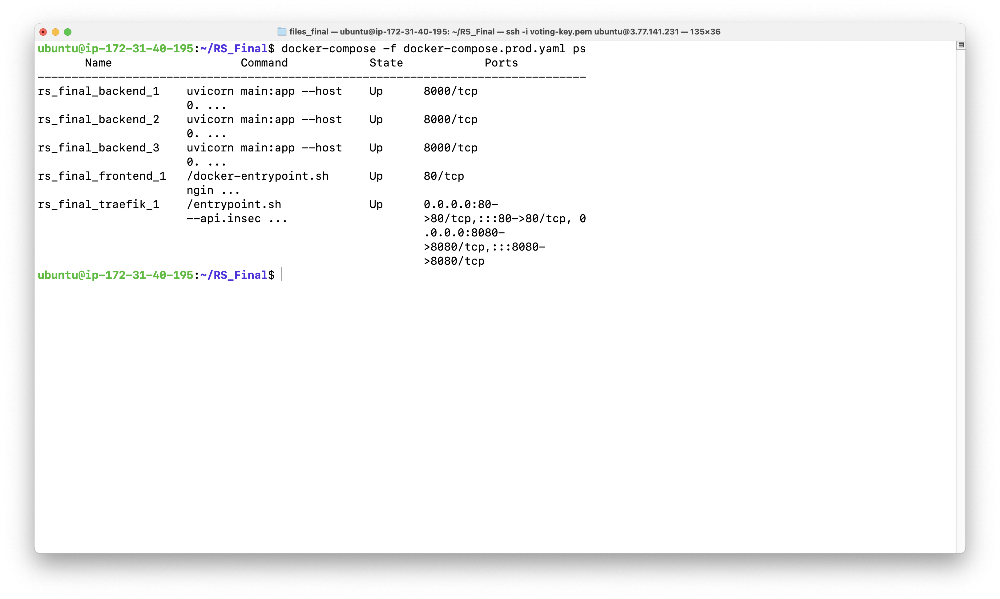
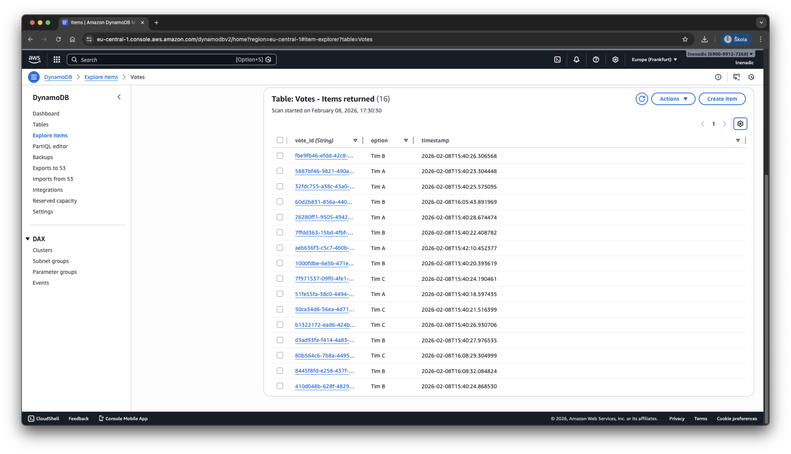

# Dokumentacija Projekta: Distribuirana Cloud Aplikacija za Glasovanje

## High Scale Voting System


**Student:** Lovre Nenadić
**Kolegij:** Raspodijeljeni sustavi
**Godina:** 2026.

---

## 1. Uvod i Cilj Projekta
Cilj ovog projekta bio je razviti, kontejnerizirati i deployati skalabilnu web aplikaciju u oblaku. Sustav omogućuje korisnicima glasovanje između tri opcije, pri čemu se podaci trajno spremaju u **AWS DynamoDB**, a promet se raspoređuje na više instanci aplikacije pomoću **Load Balancera**.

Aplikacija je javno dostupna na domeni: `http://rs-final.duckdns.org`

---

## 2. Arhitektura Sustava

Sustav je dizajniran prema principima mikroservisne arhitekture. Sastoji se od sljedećih komponenti:

1.  **Client (Frontend):** Nginx server koji servira statičke datoteke (HTML/JS).
2.  **Reverse Proxy & Load Balancer (Traefik):** Upravlja ulaznim prometom i raspoređuje ga na dostupne backend kontejnera.
3.  **Backend Cluster:** Tri (3) paralelne instance Python (FastAPI) aplikacije.
4.  **Baza Podataka:** AWS DynamoDB (NoSQL) za postojanost podataka.

### Dijagram toka podataka:
`Korisnik -> DuckDNS Domena -> AWS EC2 (Traefik) -> [Backend 1 / 2 / 3] -> AWS DynamoDB`

---

## 3. Implementacija i Tehnologije

Za realizaciju projekta korištene su sljedeće tehnologije:

| Komponenta | Tehnologija | Opis |
| :--- | :--- | :--- |
| **Infrastruktura** | AWS EC2 (t2.micro) | Ubuntu Server 22.04 LTS instanca. |
| **Kontejnerizacija** | Docker & Docker Compose | Izolacija aplikacije i orkestracija servisa. |
| **Backend** | Python 3.10 + FastAPI | REST API za obradu glasova. |
| **Baza Podataka** | AWS DynamoDB | Managed NoSQL baza u oblaku (regija eu-central-1). |
| **Load Balancer** | Traefik v2.11 | Automatsko otkrivanje servisa i usmjeravanje prometa. |
| **DNS** | DuckDNS | Dinamički DNS za mapiranje javne IP adrese. |

### Ključni dio konfiguracije (docker-compose.prod.yaml):
Prikaz konfiguracije Load Balancera koji dinamički prepoznaje backend servise:

```yaml
  backend:
    build: ./backend
    labels:
      - "traefik.enable=true"
      - "traefik.http.routers.backend.rule=Host(`rs-final.duckdns.org`) && PathPrefix(`/vote`)"
    deploy:
      replicas: 3
```

## 4. Demonstracija Rada Aplikacije

U ovom poglavlju prikazani su ključni dokazi funkcionalnosti sustava: pristup web sučelju, rad distribuiranih kontejnera i zapisivanje podataka u oblak.

### 4.1. Web Sučelje (Frontend)
Aplikaciji se pristupa putem javne domene `rs-final.duckdns.org`. Traefik (Load Balancer) preusmjerava zahtjev na Frontend kontejner koji servira HTML stranicu.
Korisnik može odabrati opciju "Tim A", "Tim B" ili "TIM C", a sučelje prikazuje potvrdu o zaprimljenom glasu.

<!--
Source - https://stackoverflow.com/a/41912122
Posted by Philipp Schwarz, modified by community. See post 'Timeline' for change history
Retrieved 2026-02-08, License - CC BY-SA 4.0
-->


---

### 4.2. Infrastruktura i Skaliranje (Terminal)
Prikaz stanja Docker kontejnera na AWS EC2 instanci.
Vidljivo je da su aktivna **tri (3) backend servisa** (`rs_final_backend_1`, `_2`, `_3`) koji rade paralelno, osiguravajući raspodjelu opterećenja i visoku dostupnost.



---

### 4.3. Perzistencija Podataka (AWS DynamoDB)
Podaci o glasovima se ne spremaju lokalno u kontejnerima (koji su *stateless*), već se šalju u **AWS DynamoDB** (Cloud baza podataka).
Slika prikazuje tablicu `Votes` u AWS konzoli, gdje su vidljivi zapisi s jedinstvenim ID-om (`vote_id`), odabranom opcijom (`option`) i vremenskim žigom. Ovo potvrđuje da backend uspješno komunicira s AWS uslugama.



---

##  5. Zaključak

Ovaj projekt pokazuje kako se gradi moderna aplikacija koja koristi "Cloud-Native" pristup. Realizacijom aplikacije postignuto je sljedeće:

1. **Kontejnerizacija:** Korištenjem Dockera, aplikacija je pakirana u kontejnere što znači da radi isto na svim računalima; bilo to razvojno okruženje, testni server ili produkcija.

2. **Skaliranje:** Pomoću `docker-compose` alata omogućeno je pokretanje više backend instanci odjednom. Kada aplikacija ima više korisnika, sustav se može prilagoditi tako što pokreće dodatne instance.

3. **Cloud tehnologije:** Aplikacija je postavljena na **AWS EC2** serveru, što znači da je dostupna 24/7 neovisno o lokalnom računalu. Podaci se čuvaju u **DynamoDB** bazi podataka koja također radi u oblaku, što osigurava trajnost i sigurnost podataka.

4. **Javna dostupnost:** Preko DuckDNS servisa aplikacija je dostupna putem javne domene, a pristup je osiguran AWS Security grupama koje funkcioniraju kao vatrozid.

5. **Otpornost na kvarove:** Dizajn sustava izbjegava problem "single point of failure" - ako jedna backend instanca prestane raditi, sustav nastavlja funkcionirati. Backend servisi ne čuvaju stanje lokalno (stateless dizajn), pa Traefik load balancer automatski preusmjerava zahtjeve na preostale instance. Na taj način postiže se visoka dostupnost sustava.