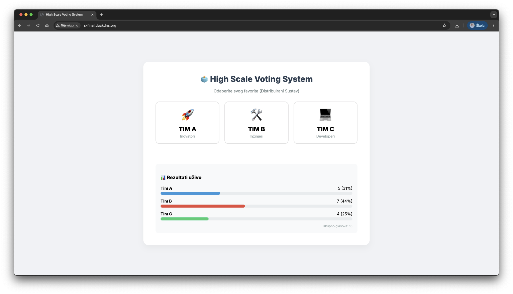

# High Scale Voting System ☁️ 🗳️

Ovaj projekt je web aplikacija za glasovanje temeljena na mikroservisnoj arhitekturi. Sustav je kontejneriziran pomoću Dockera i dizajniran za rad u AWS oblaku, uz mogućnost lokalnog testiranja pomoću LocalStack simulatora.

**Link** za pristup: http://rs-final.duckdns.org



---

## 🚀 Kako pokrenuti aplikaciju

### 1. Lokalno Pokretanje
Za testiranje na osobnom računalu. Ova konfiguracija koristi **LocalStack** za simulaciju AWS DynamoDB baze, tako da **nisu potrebni AWS ključevi**.

1. Klonirajte repozitorij:
   ```bash
   git clone <repo_url>
2. Pokrenite aplikaciju:
   ```bash
    docker-compose up
3. Pristupite aplikaciji:
   * **Web Aplikacija:** [http://localhost](http://localhost)
   * **API Dokumentacija:** [http://localhost/docs](http://localhost/docs)
   * **Traefik Dashboard:** [http://localhost:8080](http://localhost:8080)

---

### 2. Produkcijsko Pokretanje (AWS Cloud)
Za pokretanje na udaljenom serveru (EC2). Ova konfiguracija koristi stvarnu **AWS DynamoDB** bazu i **DuckDNS** domenu.

1. Spojite se na server (SSH).
2. Pokrenite aplikaciju (sa skaliranjem backenda):
   ```bash
   docker-compose -f docker-compose.prod.yaml up -d --build --scale backend=3   
3. Pristupite aplikaciji:
   * **Web Aplikacija:** [http://rs-final.duckdns.org](http://rs-final.duckdns.org)

---

## 🛠 Korištene Tehnologije

* **Backend:** Python 3.10 (FastAPI)
* **Frontend:** Nginx, HTML, JavaScript
* **Baza Podataka:** AWS DynamoDB (Produkcija) / LocalStack (Razvoj)
* **Load Balancer:** Traefik v2.11
* **Infrastruktura:** Docker, Docker Compose, AWS EC2

---

## 📂 Struktura Projekta

```text
backend/                 # Izvorni kod API servisa
frontend/                # Statičke datoteke web sučelja
docker-compose.yaml      # Konfiguracija za lokalni razvoj (LocalStack)
docker-compose.prod.yaml # Konfiguracija za produkciju (AWS)